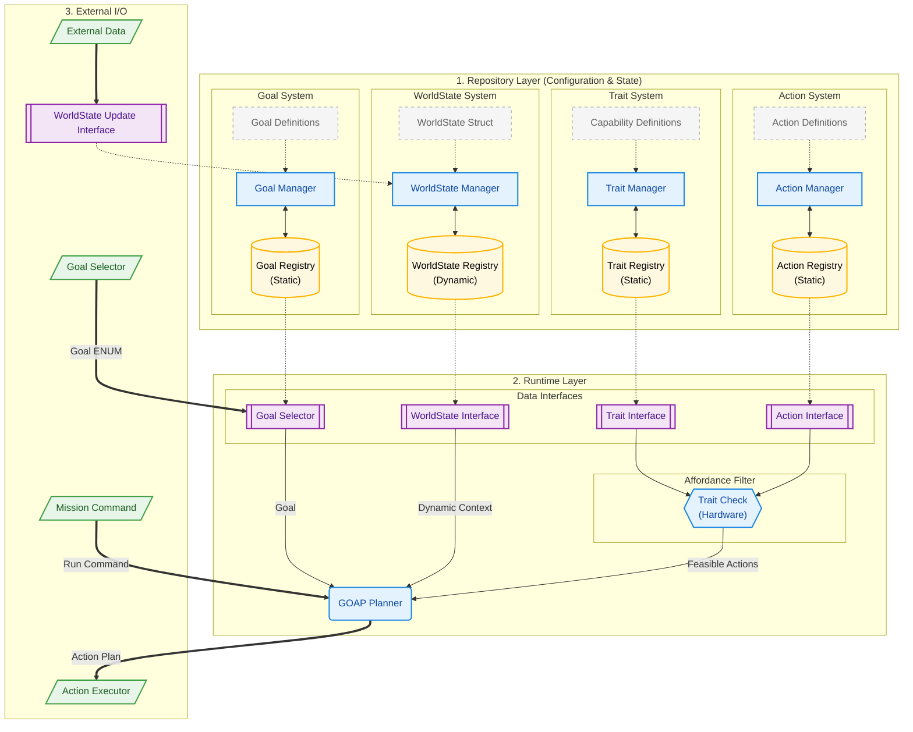
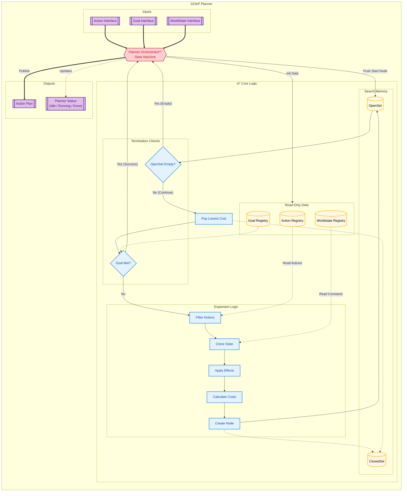

# 🧠 Goal-Oriented Action Planning (GOAP)

**A Domain-Agnostic, Type-Safe GOAP Library for Rust.**

## 1. Overview

This a high-performance **Goal-Oriented Action Planning (GOAP)** library written in Rust. It operates strictly on the **Tactical Layer** of an autonomous agent.

This crate solves the question of **"What to do?"** (Sequencing) while remaining completely agnostic to **"How to do it?"** (Execution). It relies on a symbolic, abstract representation of the world rather than raw physical data, ensuring that your planning logic remains decoupled from hardware specifics.

### The "Agnostic" Philosophy

The planner does not know about specific object IDs, coordinates, or physics. It operates purely on **abstract capabilities and boolean states**.

| Approach | Logic | Verdict |
| --- | --- | --- |
| **Instance Specific** | *"Move to Tree_ID_42 at (10, 20). If dist < 1.0m, Pick Apple_99."* | ❌ **Brittle.** Fails if IDs change or trees move. |
| **GOAP (Tactical)** | **Goal:** `Has(Apple)`  

  **State:** `at_tree: true`, `tree_has_apple: true`  

  **Plan:** `Climb` -> `Pick` | ✅ **Robust.** Works for any tree, anywhere. |

---

## 2. High-Level Architecture

The system maintains a strict separation between **Static Configuration** (Repositories), **Dynamic Planning** (Runtime), and **External Reality** (I/O).

### Key Layers

1. **Repositories:** Static definitions of what the agent *is* (Traits), what it can *do* (Actions), and what it *wants* (Goals).
2. **Runtime:** The active decision-making layer. It filters actions based on hardware traits (e.g., "Do I have a thermal camera?") before planning.
3. **I/O:** The bridge to the external application, handling sensor fusion and executing the final plan.

---

## 3. Internal Logic: The Orchestrator Pattern

Internally, GOAP uses an **Orchestrator Pattern** to ensure concurrency safety and clean state management. The `PlanningOrchestrator` wraps the raw A* Engine, handling lifecycle events (Idle -> Running -> Done) and interfacing with the outside world.

### Component Breakdown

* **Planner Orchestrator:** The public API surface. It manages the `PlannerStatus` and triggers the search.
* **Registries:** Read-only storage for the `WorldState` layout and available `Actions`.
* **A* Engine:** The core algorithm that expands nodes.
* **CloneWS:** Efficiently clones the state for simulation.
* **Apply Effects:** Mutates the cloned state based on Action definitions.
* **Calc:** Computes G-Cost (Path) and H-Cost (Heuristic).

---

## 4. Data Contracts (Traits)

To use this library, the external system must implement the core traits defined in `src/interface/traits.rs`.

### 1. The WorldState Contract

The external system is responsible for Sensor Fusion. It must distill complex physics into a `WorldState` struct that implements the library's trait.

| Physical Reality (External) | Abstraction (Internal WorldState) |
| --- | --- |
| `UserPos: (10, 10), TreePos: (10, 11)` | `is_at_tree: True` |
| `Battery Voltage: 10.2V` | `battery_state: Critical` |

### 2. Logic vs. Cost Philosophy

The planner uses **Extreme Cost Abstraction** to handle soft constraints without requiring complex conditional logic inside the planner.

* **Logic (Strict):** Uses only **Boolean** or **Enum**.
* *Rule:* "I can `Fly` if `is_flying` is True."

* **Cost (Soft):** Uses **Floats** to discourage behavior.
* *Rule:* If `battery_state` is `Critical`, the `Fly` action remains valid, but its Cost increases to `10,000`.
* *Result:* The planner naturally avoids flying unless absolutely necessary.

---

## 5. Integration Workflow

To integrate GOAP into your Rust application:

1. **Define WorldState:** Create a struct representing your domain (e.g., `RobotState`) and implement the `WorldState` trait.
2. **Define Actions:** Create structs for your capabilities (e.g., `Move`, `Scan`) implementing the `Action` trait.
3. **Instantiate Manager:** Initialize the `PlanningOrchestrator`.
4. **Run:** Pass the Start State, Goal State, and Action List to the manager.